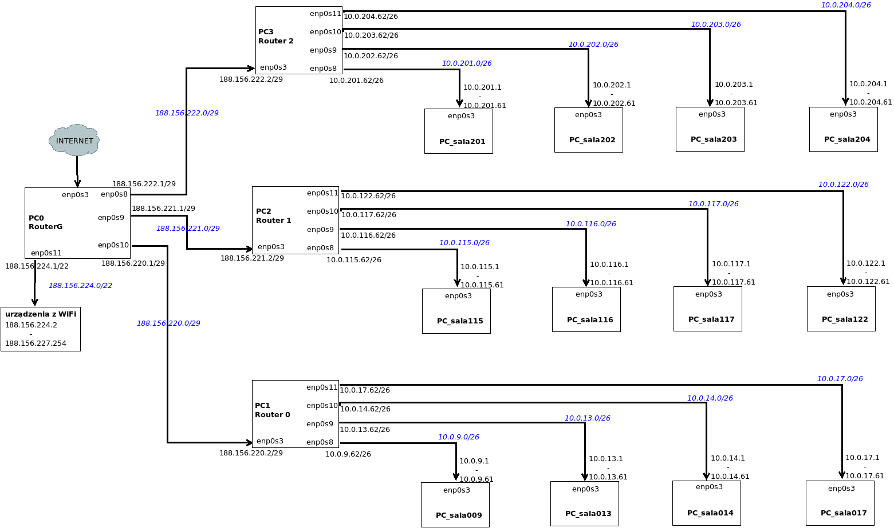

```
1. Ustalenie netmaski
  - Sieci z routera głównego i routerów na piętrach potrzebują 2 adresów 
    więc maska dla bezpieczeństwa /29 255.255.255.248
  - W każdym labolatorium jest 35 stanowisk więc /26 255.255.255.192
  - Dla wifi min liczba urządzeń to 800 więc maska to /22 255.255.252.0
  
2. Ustalenie sieci
  188.156.220.160 to adres bazowy
  
  Router główny
  - piętro 0: 188.156.220.0/29
  - piętro 1: 188.156.221.0/29
  - piętro 2: 188.156.222.0/29
  - wifi: 188.156.224.0/22
  
  Router 0
  - 009
    10.0.9.0/26
  - 013
    10.0.13.0/26
  - 014
    10.0.14.0/26
  - planowane 017
    10.0.17.0/26
    
  Router 1
  - 115
    10.0.115.0/26
  - 116
    10.0.116.0/26
  - 117
    10.0.117.0/26
  - 122
    10.0.122.0/26
    
  Router 2
  - 201
    10.0.201.0/26
  - 202
    10.0.202.0/26
  - 203
    10.0.203.0/26
  - planowane 204
    10.0.204.0/26
    
3. Dodanie adresów IP
  PC0 RouterG
    enp0s3: internet
    enp0s8 (dla piętra 0)
      address 188.156.220.1
      netmask 255.255.255.248
    enp0s9 (dla piętra 1)
      address 188.156.221.1
      netmask 255.255.255.248
    enp0s10 (dla piętra 2)
      address 188.156.222.1
      netmask 255.255.255.248
    enp0s11 (dla wifi)
      address 188.156.224.1
      netmask 255.255.252.0
        
        Urządzenia pod wifi
          adresy z dhcp 188.156.224.2 - 188.156.227.254
      
  PC1 Router0
    enp0s3
      address 188.156.220.2
      netmask 255.255.255.248
    enp0s8
      address 10.0.9.62
      netmask 255.255.255.192
    enp0s9
      address 10.0.13.62
      netmask 255.255.255.192
    enp0s10
      address 10.0.14.62
      netmask 255.255.255.192
    enp0s11
      address 10.0.17.62
      netmask 255.255.255.192
          
        PCty w sali 009 pod Routerem0
          adresy z dhcp 10.0.9.1 - 10.0.9.61
        PCty w sali 013 pod Routerem0
          adresy z dhcp 10.0.13.1 - 10.0.13.61
        PCty w sali 014 pod Routerem0
          adresy z dhcp 10.0.14.1 - 10.0.14.61
        PCty w sali 017 pod Routerem0
          adresy z dhcp 10.0.17.1 - 10.0.17.61

  PC2 Router1
    enp0s3
      address 188.156.221.2
      netmask 255.255.255.248
    enp0s8
      address 10.0.115.62
      netmask 255.255.255.192
    enp0s9
      address 10.0.116.62
      netmask 255.255.255.192
    enp0s10
      address 10.0.117.62
      netmask 255.255.255.192
    enp0s11
      address 10.0.122.62
      netmask 255.255.255.192
      
        PCty w sali 115 pod Routerem1
          adresy z dhcp 10.0.115.1 - 10.0.115.61
        PCty w sali 116 pod Routerem1
          adresy z dhcp 10.0.116.1 - 10.0.116.61
        PCty w sali 117 pod Routerem1
          adresy z dhcp 10.0.117.1 - 10.0.117.61
        PCty w sali 122 pod Routerem1
          adresy z dhcp 10.0.122.1 - 10.0.122.61
      
  PC3 Router2
    enp0s3
      address 188.156.222.2
      netmask 255.255.255.248
    enp0s8
      address 10.0.201.62
      netmask 255.255.255.192
    enp0s9
      address 10.0.202.62
      netmask 255.255.255.192
    enp0s10
      address 10.0.203.62
      netmask 255.255.255.192
    enp0s11
      address 10.0.204.62
      netmask 255.255.255.192
        
        PCty w sali 201 pod Routerem2
          adresy z dhcp 10.0.201.1 - 10.0.201.61
        PCty w sali 202 pod Routerem2
          adresy z dhcp 10.0.202.1 - 10.0.202.61
        PCty w sali 203 pod Routerem2
          adresy z dhcp 10.0.203.1 - 10.0.203.61
        PCty w sali 204 pod Routerem2
          adresy z dhcp 10.0.204.1 - 10.0.204.61
            
4. Uruchomienie dhcp + wpisanie dns
  PC0 RouterG
    WIFI
      nano /etc/default/isc-dhcp-server 
        odkomentować ścieżkę do pliku config DHCPDv4_CONF
        dopisać interfejs INTERFACESv4="enp0s10"
      nano /etc/dhcp/dhcpd.conf - dopisać konfiguracje sieci :
        subnet 188.156.224.0 netmask 255.255.252.0 {
          range 188.156.224.2 188.156.227.254;
          option routers 188.156.224.1;
          option domain-name-servers 1.1.1.1, 1.0.0.1;
        }
      systemctl restart isc-dhcp-server
    
  PC1 Router0 (osobny subnet config dla każdego)
    SALA 009|013|014|017 
      nano /etc/default/isc-dhcp-server 
        odkomentować ścieżkę do pliku config DHCPDv4_CONF
        dopisać interfejs INTERFACESv4="enp0s8 enp0s9 enp0s10 enp0s11"
      nano /etc/dhcp/dhcpd.conf - dopisać konfiguracje sieci :
        subnet 10.0.9|13|14|17.0 netmask 255.255.255.192 {
          range 10.0.9|13|14|17.1 10.0.9|13|14|17.61;
          option routers 10.0.9|13|14|17.62;
          option domain-name-servers 1.1.1.1, 1.0.0.1;
        }
      systemctl restart isc-dhcp-server
  
  PC2 Router1 (osobny subnet config dla każdego)
    SALA 115|116|117|122
      nano /etc/default/isc-dhcp-server 
        odkomentować ścieżkę do pliku config DHCPDv4_CONF
        dopisać interfejs INTERFACESv4="enp0s8 enp0s9 enp0s10 enp0s11"
      nano /etc/dhcp/dhcpd.conf - dopisać konfiguracje sieci :
        subnet 10.0.115|116|117|122.0 netmask 255.255.255.192 {
          range 10.0.115|116|117|122.1 10.0.115|116|117|122.61;
          option routers 10.0.115|116|117|122.62;
          option domain-name-servers 1.1.1.1, 1.0.0.1;
        }
      systemctl restart isc-dhcp-server
  
  PC3 Router2 (osobny subnet config dla każdego)
    SALA 201|202|203|204
      nano /etc/default/isc-dhcp-server 
        odkomentować ścieżkę do pliku config DHCPDv4_CONF
        dopisać interfejs INTERFACESv4="enp0s8 enp0s9 enp0s10 enp0s11"
      nano /etc/dhcp/dhcpd.conf - dopisać konfiguracje sieci :
        subnet 10.0.201|202|203|204.0 netmask 255.255.255.192 {
          range 10.0.201|202|203|204.1 10.0.201|202|203|204.61;
          option routers 10.0.201|202|203|204.62;
          option domain-name-servers 1.1.1.1, 1.0.0.1;
        }
      systemctl restart isc-dhcp-server
        
5. Ustalnie routingu
  PC1 Router0
    up ip rotue add default via 188.156.220.1
    
       PCty pod routerem0 w sali 009|013|014|017 (już w dhcp server)
         up ip route add default via 10.0.9|13|14|17.62
    
  PC2 Router1
    up ip rotue add default via 188.156.221.1
    
       PCty pod routerem1 w sali 115|116|117|122 (już w dhcp server)
         up ip route add default via 10.0.115|116|117|122.62 
  
  PC3 Router2
    up ip rotue add default via 188.156.222.1
    
       PCty pod routerem1 w sali 201|202|203|204 (już w dhcp server)
         up ip route add default via 10.0.201|202|203|204.62
        
  urządzenia z wifi (już w dhcp server)
    up ip rotue add default via 188.156.224.1
         
6. Włączenie forwardowania ip
  PC z routerami
  odkomentować net.ipv4.ip_forward=1 w /etc/sysctl.d/99-sysctl.conf

7. Włączenie reguły masquerade
  
  PC0 RouterG
  iptables -t nat -A POSTROUTING -s 188.156.220.0/29 -o enp0s3 -j MASQUERADE
  iptables -t nat -A POSTROUTING -s 188.156.221.0/29 -o enp0s3 -j MASQUERADE
  iptables -t nat -A POSTROUTING -s 188.156.222.0/29 -o enp0s3 -j MASQUERADE
  iptables -t nat -A POSTROUTING -s 188.156.224.0/22 -o enp0s3 -j MASQUERADE
  
  PC1 Router0
  iptables -t nat -A POSTROUTING -s 10.0.9.0/26 -o enp0s3 -j MASQUERADE
  iptables -t nat -A POSTROUTING -s 10.0.13.0/26 -o enp0s3 -j MASQUERADE
  iptables -t nat -A POSTROUTING -s 10.0.14.0/26 -o enp0s3 -j MASQUERADE
  iptables -t nat -A POSTROUTING -s 10.0.17.0/26 -o enp0s3 -j MASQUERADE
                                 
  PC2 Router1
  iptables -t nat -A POSTROUTING -s 10.0.115.0/26 -o enp0s3 -j MASQUERADE
  iptables -t nat -A POSTROUTING -s 10.0.116.0/26 -o enp0s3 -j MASQUERADE
  iptables -t nat -A POSTROUTING -s 10.0.117.0/26 -o enp0s3 -j MASQUERADE
  iptables -t nat -A POSTROUTING -s 10.0.122.0/26 -o enp0s3 -j MASQUERADE
  
  PC3 Router2
  iptables -t nat -A POSTROUTING -s 10.0.201.0/26 -o enp0s3 -j MASQUERADE
  iptables -t nat -A POSTROUTING -s 10.0.202.0/26 -o enp0s3 -j MASQUERADE
  iptables -t nat -A POSTROUTING -s 10.0.203.0/26 -o enp0s3 -j MASQUERADE
  iptables -t nat -A POSTROUTING -s 10.0.204.0/26 -o enp0s3 -j MASQUERADE
  
  zapisanie reguł:
    ipatables-save > /etc/iptables.up.rules
    
    dodanie wpisu w /etc/network/interfaces
      post-up iptables-restore < /etc/iptables.up.rules
    
```